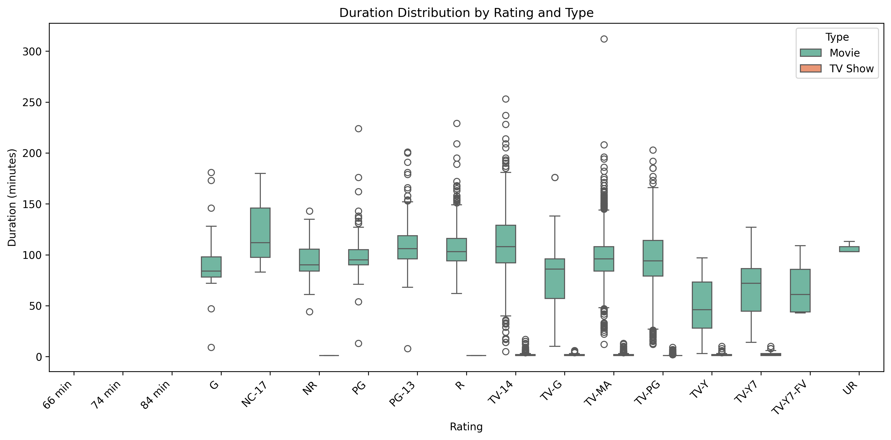

# Netflix Content Analysis – Asia Focus

Exploratory data analysis of Netflix titles (2021 dataset) with emphasis on Asian content trends.

## Objective
Showcase data cleaning, SQL querying, visualization, and insight generation skills for a data analyst role.

## Dataset
- Source: [Kaggle – Netflix Movies and TV Shows](https://www.kaggle.com/datasets/shivamb/netflix-shows)
- File: netflix_titles.csv (~8,800 titles)

## Tools & Technologies
- Python 3
- Pandas
- SQLite (in-memory)
- Matplotlib + Seaborn
- Jupyter Notebook

## Key Insights
- Genres in Asia: Asia-wide (India, Japan, Korea dominant): Top genres include Dramas, International Movies, Comedies, Action & Adventure, International TV Shows.
- Asian Content Trends: Additions low pre-2015 (<50/year); sharp growth 2016–2020 (peak ~300/year in 2019-2020), then stable ~200/year in 2021. India leads Asian production.
- Ratings vs Duration/Type: Weak rating-duration correlation (e.g., TV-MA avg ~95 min for movies, similar to others); strong type-duration link—movies avg ~99 min, TV shows avg ~1.8 seasons (duration in seasons, not minutes).
- Overall: US dominates (~32% titles); 70% movies vs 30% TV; TV-MA most common rating (36%); recent content (2010s+) ~80% of catalog.

## Visualizations
  
  
  

## Files
- Netflix Analysis.ipynb  
- requirements.txt  
- images/ (exported plots)

MIT License
